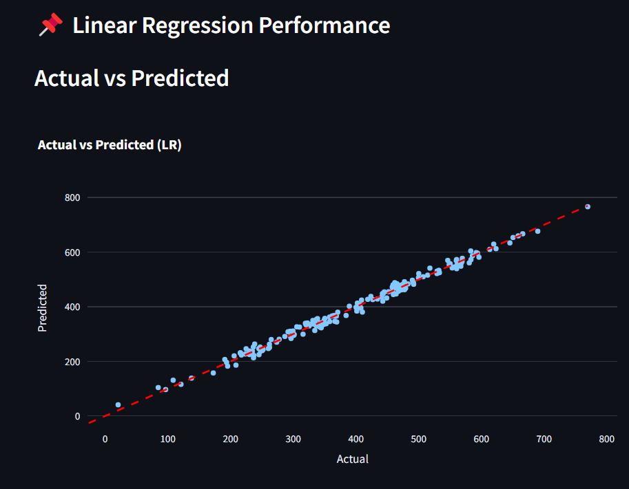
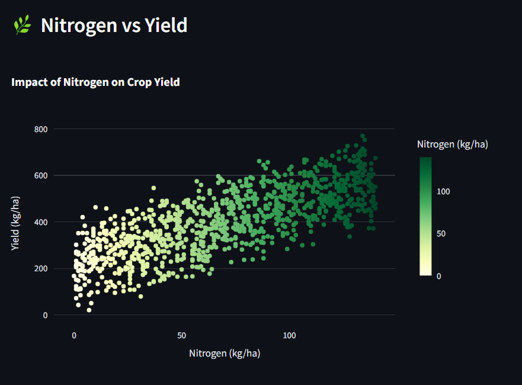

---

### ✅ `README.md`

```markdown
# 🌾 Smart Farming Crop Yield Prediction Dashboard

An interactive data visualization dashboard for analyzing and predicting crop yield based on various agricultural inputs. Built using **PySpark**,**Streamlit**, **Plotly**, and **Pandas**, and **Unified Python Packaging (uv)**.

---

## 🚀 Features

- Predict crop yield using **Linear Regression** and **Random Forest**
- Visualize actual vs predicted yield and residuals
- Interactive charts and correlation heatmaps
- View top contributing features
- Apply filters and dropdowns for better data exploration
- Clean, responsive Streamlit layout

---

## 📷 Screenshots

| 📊 Actual vs Predicted | 🌿 Nitrogen vs Yield |
|------------------------|----------------------|
|  |  |

---
## 🗂️ Project Structure

```
smart-farm-predic/
│
├── proj.py                  # Main Streamlit app logic
├── main.py                  # Optional CLI or alternate entry point
├── README.md
├── smart_farming_crop_yield_prediction.csv
├── pyproject.toml           # Dependency and project metadata (uv)
├── uv.lock                  # Locked dependencies (auto-generated)
├── .venv/                   # In-project virtual environment (optional)
└── assets/                  # Charts and images for UI + README
```

---

## 🛠️ How to Run

Make sure you have Python `>=3.10` and [`uv`] installed.

### 1. Clone the repository

```bash
git clone https://github.com/Aditya-jaiswal07972/Spark-Smart-Farm-yield-prediction.git
cd smart-farm-predic
```

### 2. Install dependencies using `uv`

```bash
uv venv                     # Creates a `.venv` virtual environment inside the project
uv pip install              # Installs from pyproject.toml / uv.lock
```

Or install globally without virtualenv:

```bash
uv pip install --system
```

### 3. Run the Streamlit app

```bash
# Option 1: Directly run proj.py
streamlit run proj.py

# Option 2: Run main.py which calls proj.py
python main.py
```

---

## 📦 Key Dependencies

Declared in `pyproject.toml`, including:

- `streamlit`
- `pyspark`
- `pandas`
- `plotly-express`
- `seaborn`
- `matplotlib`

---

## 👨‍🌾 Author

Built with ❤️ by **Aditya Jaiswal** ([@Aditya-jaiswal07972](https://github.com/Aditya-jaiswal07972))

---

## 📄 License

This project is licensed under the MIT License. Feel free to use and modify!
```

---
